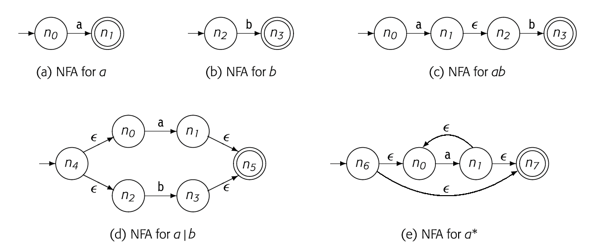
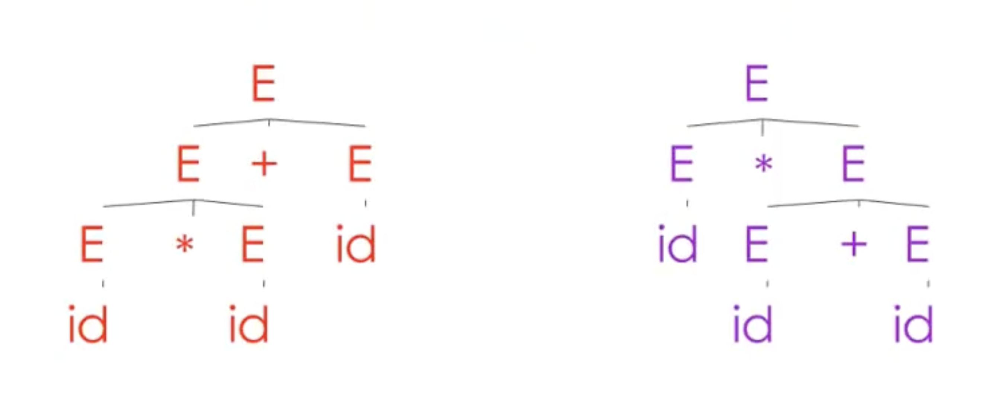
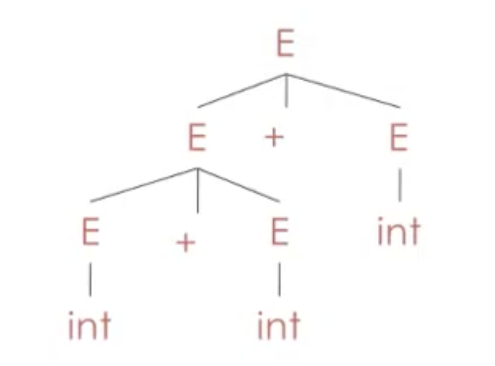

Suggested Textbook: Engineer a Compiler, Dragon book



FORTRAN language has the word's first compiler. John Backus
FORTRAN(Formula Translation) is used for scientific computing.


Why are there so many programming languages?

Each language has its own distinct domain to use. Different domain has different needs, and most of time, these needs are conflicting.

  - Scientific computing: Float point, arrays, parallelism. FORTRAN
  - Business: persistance, report generation, data analysis SQL
  - System programming: control of resources, real time constraints C/C++

It is impossible to integrate all these things together.

Why are there new programming languages?

Programmer training is the dominant cost for a programming language.

1. Widely-used languages are slow to change. C/C++
2. Easy to start a language. Cna evolve quickly
Tension between these two. Productivity or training cost.
New domain may need new language. 

What is a good programming language?

There is no universally accepted metric for language design.

Tips: In Linux, if you want to execute the last command you type. Just try 

Lexical Analysis
Simple speak, it is a divider in codes. 
It also classify the tokens.(Token class) Divides the codes into different tokens.(identifier, keywords, "(", ")", numbers...)
Official:
- Classify program substrings according to role(token class)
- Communicate tokens wo the parser

Left to right scan. So, sometimes lookahead is required.(Lookahead means look what are next)

### Regular Languages
Regular expressions specify regular languages
Regular expressions are syntax, while the regular languages are sets of strings. 
### Regular Expression
- Base cases
  * Single Character
    'c' = {"c"}
  * Epsilon
    The language consisting only for empty string
    $\epsilon$ = {""} $\epsilon$ is not empty set($\emptyset$)
- Compound Expressions
  These expressions can be built with other regular expressions.
  * Union
    $ A + B = \{a \vert a \in A\} \cap \{b \vert b \in B\}$   
  * Concatenation
    $ AB = \{ab \vert a \in A \wedge b \in B\}$
  * Iteration
    Kleene Closure 
    $A* = \cup _{i \geqq 0} A^i = A^0 \cup A^1 \cup A^2 \cup....$
    $A^0 = \epsilon$
- Other:
  * Positive Closure
    $A^+=\cup _{i \geqq 1} A^i = A^1 \cup A^2 \cup A^3 \cup....$
    $A^+= AA^*$
  * Option
    $A?=\{""\}\cap\{A\}$

Examples:
We have a alphabet $\Sigma$, which only have two elements 0 and 1
$\Sigma = \{0, 1\}$
In this case:
- $1^*$
  $1^* = \cup _{i \geqq 0} 1^i = "" \cup 1 \cup 11 \cup...$
  All strings of 1s
- $(1+0)1$
  $(1+0)1 = \{ab \vert a\in (1+0), b \in 1\} = \{11, 01\}$
- $0^*+1^*$
  $0^*+1^* = \{\cup _{i \geqq 0} 0^i + \cup _{i \geqq 0} 1^i\} = \{"", 0, 00, 000, 1, 11, 111,...\}$
- $(0+1)^*$
  $(0+1)^* = \cup _{i \geqq 0} (0+1)^i$ = \{"", 0+1, (0+1)(0+1), ...\}
  All strings of 0s and 1s. This set contains all possible string the alphabet $\Sigma$ can generate. We have a special symbol for it, $\Sigma^*$


### Formal Languages
Differences between regular language, formal language and regular expression
We have an alphabet $\Sigma$
The collection of all words over $\Sigma$ is denoted $\Sigma^*$
A **formal language** over the alphabet $\Sigma$ is a set of words over $\Sigma$.Equivalently, a formal language is a subset of $\Sigma^*$
A **regular language** over $\Sigma$ is a formal language over $\Sigma$ which is accepted by some DFA,
A **regular expression** is defined above.(Empty, single character, union, concatenation, kleene closure)

**Maximal Much: When we have two or more tokens have the same prefix, we will always choose the longer one.**
Example: "=" and "=="

**If one string is matched with two different kind of specifications, we use priority ordering.**
Example: $"if" \in Keywords, "if" \in Identifiers$, we will always parse the identifier first. It is hard for identifier to exclude 
all keywords. We can use priority to avoid the problem. When a higher priority specification is matched, the token is recognized.

### Finite Automata(FA)
  - An input alphabet $\Sigma$
  - A set of states $S$
  - A state state $n$
  - A set of accepting states $F\subseteq S$
  - A set of transitions $state\rightarrow ^{input}state$


### Deterministic Finite Automata(DFA)
  - One transition per input per state
  - No $\epsilon$-moves

### Nondeterministic Finite Automata(NFA)
  - Can have multiple transitions for one input in a given state(The result of transition is not determined)
  - Can have $\epsilon$-moves(The transition can move without input consumption)

Success: Arrive final State and Finish scanning.

### Convert FA to RE
a
### Convert RE to miniDFA

#### Covert RE to NFA


#### Convert NFA to DFA
$\epsilon$-closure: The set of all states that can be reached from current state via one or more ε transitions.
  1. Begin with the start state, the $\epsilon$-closure of NFA start state will be the start state of DFA
  2. Select one output of the current state, find all $\epsilon$-closure of the output. It will be de destination of DFA on that output.(If the transition can not be viewed on NFA, we can calculate it by using union operation.)
  3. Repeat 2 until traverse all possible transitions in the NFA.

#### Convert DFA to miniDFA
Hopcroft's Algorithm


### Implement FA
A DFA can ve implemented by a 2D table.
 - Each row represents one state
 - Each column represents input symbol
 - The cross of row and column is the destination of transition $S_i \rightarrow^{input} S_k$
To save memory, we can use a linked list to store repeated row.

### Parsing
Why we need parsing?
Some languages can not be represented by RE.
  Example : $\{(^i)^i | i \geqq 0\}$ , paired parentheses.
What can regular languages express?
  It can track if the string is divisible by three or some other similar property.
  But it can not do things like count to arbitrary i.(Like the parentheses example)
**Parsing**
 - Input sequence of tokens from lexer
 - Output parse tree of the program

| Phase  | Input                | Output           |
|--------|----------------------|------------------|
| Lexer  | String of characters | String of tokens |
| Parser | String of tokens     | Parse tree       |

### Context Free Grammar
  - A set of terminals $T$, which are the characters of the alphabet that appear in the strings generated by the grammar. No production can replace them. They are **terminal** and never change. (Maybe: The symbols in the right side of production which are not non-terminal(not showing in left side).)
  - A set of non-terminals $N$, which are placeholders for patterns of terminal symbols that can be generated by the nonterminal symbols.
  - A start symbol $S, S\in N$, which is a special nonterminal symbol that appears in the initial string generated by the grammar.
  - A set of productions $X\rightarrow Y_1, Y_2..., X\in N, Y_i \in N \cup T\cup \epsilon$, which are rules for replacing (or rewriting) nonterminal symbols (on the left side of the production) in a string with other nonterminal or terminal symbols (on the right side of the production).

Example:

**For balanced parentheses:**

- $S\rightarrow (S)$
- $S\rightarrow \epsilon$
- $N = \{ S\}$
- $T = \{(,)\}$

**An example grammar that generates strings representing arithmetic expressions with the four operators +, -, \*, /, and numbers as operands is:**

```
<expression> --> number
<expression> --> ( <expression> )
<expression> --> <expression> + <expression>
<expression> --> <expression> - <expression>
<expression> --> <expression> * <expression>
<expression> --> <expression> / <expression>
```

The only nonterminal symbol in this grammar is <expression>, which is also the start symbol. The terminal symbols are {+,-,*,/,(,),number}. (We will interpret "number" to represent any valid number.)

The first rule (or production) states that an <expression> can be rewritten as (or replaced by) a number. In other words, a number is a valid expression.

The second rule says that an <expression> enclosed in parentheses is also an <expression>. Note that this rule defines an expression in terms of expressions, an example of the use of recursion in the definition of context-free grammars.

The remaining rules say that the sum, difference, product, or division of two <expression>s is also an expression.

Productions can be read as rules. 

$S\rightarrow (S)$

Whenever I see an S in string, we can replace it by the string of symbols on the right side.

1. Begin with a string with only the start symbol $S$
2. Replace any non-terminal $X$ in the string by the right side of some production $X\rightarrow Y_1...Y_n$
3. Repeat 2 until there are no non-terminals

### Derivation

A derivation is a sequence of productions
$$
S\rightarrow...\rightarrow...\rightarrow...\rightarrow...\rightarrow...
$$ 

A derivation can be drawn as a tree
  - Start symbol is the tree's root
  - For a production $X\rightarrow Y_1..Y_n$ and children $Y_1...Y_n$ to node $X$

# parse tree image

Parse tree
  - Terminals at the leaves
  - Non-terminal at the interior nodes
  - An in-order traversal of the leaves is the original input
  - The parse ree shows the association of operations, the input string does not

**Left-most derivation:** At each step, replace the left-most non-terminal, **until the terminal**. There is an equivalent notion of a right-most derivation.
*Note: the right-most and left-most derivations have the same parse tree*

### Ambiguity
A grammar is *ambiguous* if it has more than one parse tree for some string.

```
id*id+id
```
$E\rightarrow E+E | E * E | (E) | id$

Equivalently, there is more than one right-most or left-most derivation for some string.

To solve ambiguity of grammar, we have several ways. Most direct method is to rewrite the grammar
$E\rightarrow E^{'}+E | E^{'}$
$E^{'}\rightarrow id  * E^{'} | (E) * E^{'} | (E) | id$
The second production can show symmetry.

It is impossible to convert automatically an ambiguous grammar to an un ambiguous one.

The ambiguous grammar is more likely hard to understand and read.

So, for most practical parsing tools, they use more natural(ambiguous) grammar and along with disambiguous declarations.
 - Precedence declarations
 - Associativity declarations

#### Associativity declarations
$E\rightarrow E +E| int$
int + int + int
Left association declaration: %left +
*Calculate the left element first, which will cause the left operation more deep.*



#### Precedence declarations
$E\rightarrow E+E | E * E | (E) | int$
Precedence association declaration: %left +, %left *.
The precedence is determined by the order. For this case, + have higher precedence.
*Calculate the plus first, which will cause the plus operation more deep.*

Precedence in Engineering a compiler
add new nonterminal 

### Error Handling

LL(1) Lookahead leftmost

First Set, if the first is not the non-terminal. Look the nonterminal and put all terminal inside the first set. Or, just put the first terminal in it.
Follow set, go back to the derivation can generate the current left hand non terminal and find which terminal will follow that.

Can LL(1) have left recursion?
No. If one grammar is left recursion, it means it at least have S->SA and S->b. The first set of these two are joint.
<!-- ## Overview

Portable, Optimization, Convenient layer between abstract higher level language and machine(Productivity).
Syntax check. Link. One language to another language. and more.

Formal definition
- Preprocessing
- lexical analysis
- parsing
- semantic analysis
- IR conversion(Intermidiate Representation)
- code optimization
- code generation

Types:
- traditional: high to low
- source to source: rewriter
- just-in-time(JIT): during the program execution(maybe interpreter?)
- decompiler
- cross compiler
- binary recompiler: binary to binary

Motivation:
Enhance quality of program.
Metrics of quality: Speed, Reliability, resilience, extensibility, Security, Energy efficiency, readability, memory foot print, code size


Interpreter
And compiler

Answer
1. Block codes(Interpreter) Always compiler
2. Interpreter
3. Compiler, 
4. Interpreter(??)
5. Both
6. Compiler
7. Compiler 
8. Both
9. Interpreter
Two kind of compiler, before and in time

Java is different.
 Compiler use more memory than interpreter during compiling process.
 **ahead of time, just in time compiler?? Java runtime, Java compile process, JavaC**

## Lecture2

### Three pass compiler
(Can process multi-kind source code and compatible with many machines)
Front end(lexical semantic) O(0)
Middle End O(nlogn) CSC766
Back End NP Complete

#### Front End

Scanner and parser
(image)
Scanner(lexical analysis)
Map character stream into tokens
```
x = xx + 200; ---\> <id, x> = <id,xx> + <number, 200> ;
```
Token: macro of syntax
Parser:(semantic analysis) DFS? The combination of leaves is the final sentence.
Recognize context-free syntax & report errors
Scanner define syntax and parser define the sentence structure.


Middle End
Analyze IR and rewrites IR.
**Preserve the meaning of codes**
What is the meaning of the codes?(IS there are possiblities that)
The Optimizer(Middle End)
A series of passes.
Redundant, Bad Code, 

for() {
  x = x + 5
  A[i] = A[i] - 5 * i
}

Back End
(Image)

Scanner
Finite Automaton
A five-tuple(S, A, T, s0, sF)
S: set of states
A: alphabet
T: a function that takes two arguments. T(s, c) return another state s'.
s0: Start State
sF: Final State

## Lecture 3
DFA

r(0,1,2,3,4,5,6,7,8,9)+

S S0 S1 S2
A r,0,1,2,3,4,5,6,7,8,9
T T(s0,r) = s1 T(s1,(0,1,2,3,4,5,6,7,8,9))=s2 T(s2,(0,1,2,3,4,5,6,7,8,9))=s2
S0
{S2} **Finish State should be a set**

Use a 2D form to store the transition table.
(Option using linked list to replace)


Alternation Union
Concatenation 
Closure Iteration
Priority: Closure >  Concatenation > Alternation

Letters (a-zA-Z)
Digit (0-9)
Identifier Letter(Letter|Digit)*

Integer (+|-|e)(0|(1-9)digit*)
Decimal Integer.digit*
Real (Integer|Decimal)E(+|-|e)digits*
Complex (Real, Real)

r(((0|1|2)(epsilon|digit))|(3(epsilon|0|1))|(4|5|6|7|8|9)) 

1 Goal - Expr
3 Expr - Term
4 Term - Term
7 Factor - Term
5 Factor - Term * Factor
7 Factor - Factor * Factor
8 <>
-->


<!-- 1. The Hugo Blox website builder for Hugo, along with its starter templates, is designed for professional creators, educators, and teams/organizations - although it can be used to create any kind of site
2. The template can be modified and customised to suit your needs. It's a good platform for anyone looking to take control of their data and online identity whilst having the convenience to start off with a **no-code solution (write in Markdown and customize with YAML parameters)** and having **flexibility to later add even deeper personalization with HTML and CSS**
3. You can work with all your favourite tools and apps with hundreds of plugins and integrations to speed up your workflows, interact with your readers, and much more

[//]: # ([![The template is mobile first with a responsive design to ensure that your site looks stunning on every device.]&#40;https://raw.githubusercontent.com/wowchemy/wowchemy-hugo-modules/main/starters/academic/preview.png&#41;]&#40;https://hugoblox.com&#41;)

### Get Started

- 👉 [**Create a new site**](https://hugoblox.com/templates/)
- 📚 [**Personalize your site**](https://docs.hugoblox.com/)
- 💬 [Chat with the **Hugo Blox community**](https://discord.gg/z8wNYzb) or [**Hugo community**](https://discourse.gohugo.io)
- 🐦 Twitter: [@GetResearchDev](https://twitter.com/GetResearchDev) [@GeorgeCushen](https://twitter.com/GeorgeCushen) #MadeWithHugoBlox
- 💡 [Request a **feature** or report a **bug** for _Hugo Blox_](https://github.com/HugoBlox/hugo-blox-builder/issues)
- ⬆️ **Updating Hugo Blox?** View the [Update Guide](https://docs.hugoblox.com/reference/update/) and [Release Notes](https://github.com/HugoBlox/hugo-blox-builder/releases)

## Crowd-funded open-source software

To help us develop this template and software sustainably under the MIT license, we ask all individuals and businesses that use it to help support its ongoing maintenance and development via sponsorship.

### [❤️ Click here to become a sponsor and help support Hugo Blox's future ❤️](https://hugoblox.com/sponsor/)

As a token of appreciation for sponsoring, you can **unlock [these](https://hugoblox.com/sponsor/) awesome rewards and extra features 🦄✨**

## Ecosystem

- **[Bibtex To Markdown](https://github.com/GetRD/academic-file-converter):** Automatically import publications from BibTeX

## Inspiration

[Learn what other **creators**](https://hugoblox.com/creators/) are building with this template.

## Features

- **Page builder** - Create _anything_ with no-code [**blocks**](https://hugoblox.com/blocks/) and [**elements**](https://docs.hugoblox.com/reference/markdown/)
- **Edit any type of content** - Blog posts, publications, talks, slides, projects, and more!
- **Create content** in [**Markdown**](https://docs.hugoblox.com/reference/markdown/), [**Jupyter**](https://docs.hugoblox.com/getting-started/cms/), or [**RStudio**](https://docs.hugoblox.com/getting-started/cms/)
- **Plugin System** - Fully customizable [**color** and **font themes**](https://docs.hugoblox.com/getting-started/customize/)
- **Display Code and Math** - Code syntax highlighting and LaTeX math supported
- **Integrations** - [Google Analytics](https://analytics.google.com), [Disqus commenting](https://disqus.com), Maps, Contact Forms, and more!
- **Beautiful Site** - Simple and refreshing one-page design
- **Industry-Leading SEO** - Help get your website found on search engines and social media
- **Media Galleries** - Display your images and videos with captions in a customizable gallery
- **Mobile Friendly** - Look amazing on every screen with a mobile friendly version of your site
- **Multi-language** - 35+ language packs including English, 中文, and Português
- **Multi-user** - Each author gets their own profile page
- **Privacy Pack** - Assists with GDPR
- **Stand Out** - Bring your site to life with animation, parallax backgrounds, and scroll effects
- **One-Click Deployment** - No servers. No databases. Only files.

## Themes

Hugo Blox and its templates come with **automatic day (light) and night (dark) mode** built-in. Visitors can choose their preferred mode by clicking the sun/moon icon in the header.

[Choose a stunning **theme** and **font**](https://docs.hugoblox.com/getting-started/customize/) for your site. Themes are fully customizable. -->

### License

Copyright 2024-present [Yuchao Su](https://yuchaosu.com).

Released under the [MIT](https://github.com/yuchaosu/yuchaosucom/blob/main/LICENSE.md) license.
